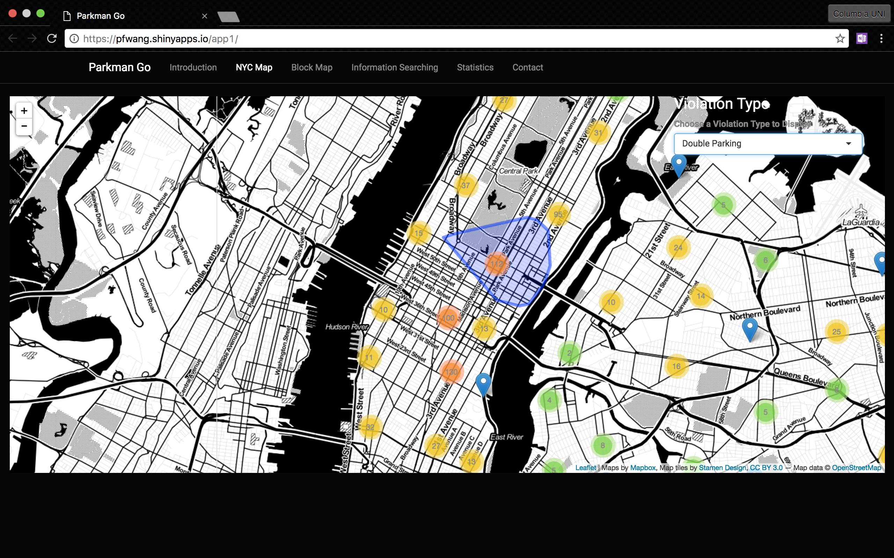
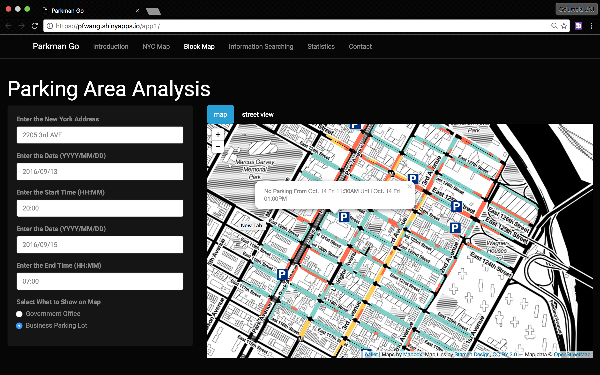
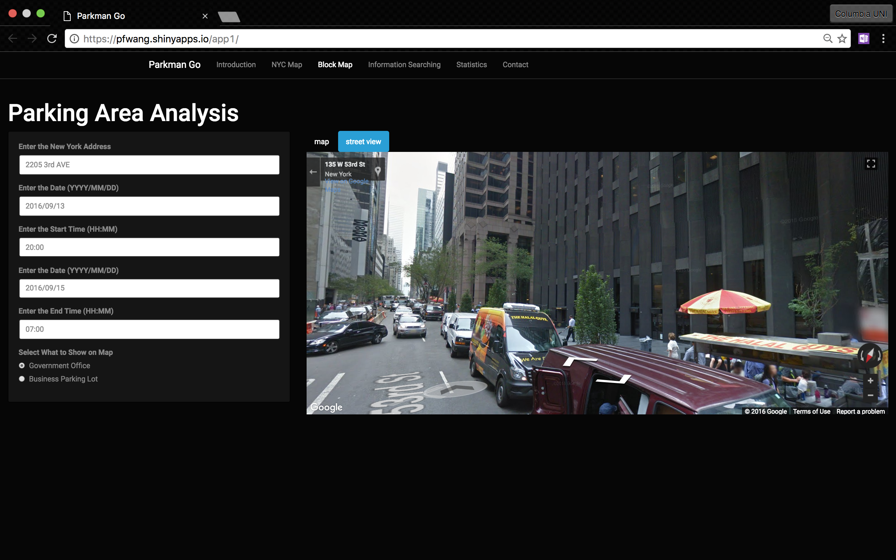
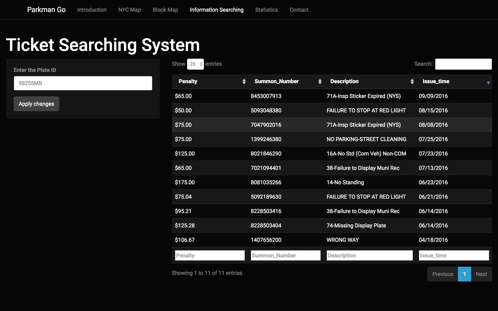

# Project: Open Data NYC - an RShiny app development project
### [Project Description](doc/project2_desc.md)

+ The website link: https://pfwang.shinyapps.io/app1/
	
+ Project summary: In this project, we are planning to develop an app for both parking lot developers and drivers in New York City. Our app is designed to have 3 functions: (1) parking violation situation checking, (2) parking lot status checking, (3) parking ticket searching. "Parking violation situation checking" part is designed for parking lot developers. Observing the areas where there are more parking violations and further checking the parking violation reasons, developers can have ideas where they should develop a new parking lot. "Parking lot status checking" part is designed for drivers. Drivers can have a look at this part before they are going to park to avoid parking violation and get a better parking. "Parking ticket searching" part is also designed for drivers. Drivers can easily find whether they have tickets and how many tickets they have through using this part. In addition, we do some basic data analysis, such as the bar plot of violation distribution and the pie chart of violation type. Hope this app is helpful.










The **learning goals** for this project is 
- business intelligence for data science
- systems development/design life cycle
- shiny app/shiny server
	
**Contribution statement**: ([default](doc/a_note_on_contributions.md)) All team members contributed equally in all stages of this project. All team members approve our work presented in this GitHub repository including this contributions statement. 

Following [suggestions](http://nicercode.github.io/blog/2013-04-05-projects/) by [RICH FITZJOHN](http://nicercode.github.io/about/#Team) (@richfitz). This folder is orgarnized as follows.

```
proj/
├── lib/
├── data/
├── doc/
├── figs/
└── output/
```

Please see each subfolder for a README file.

